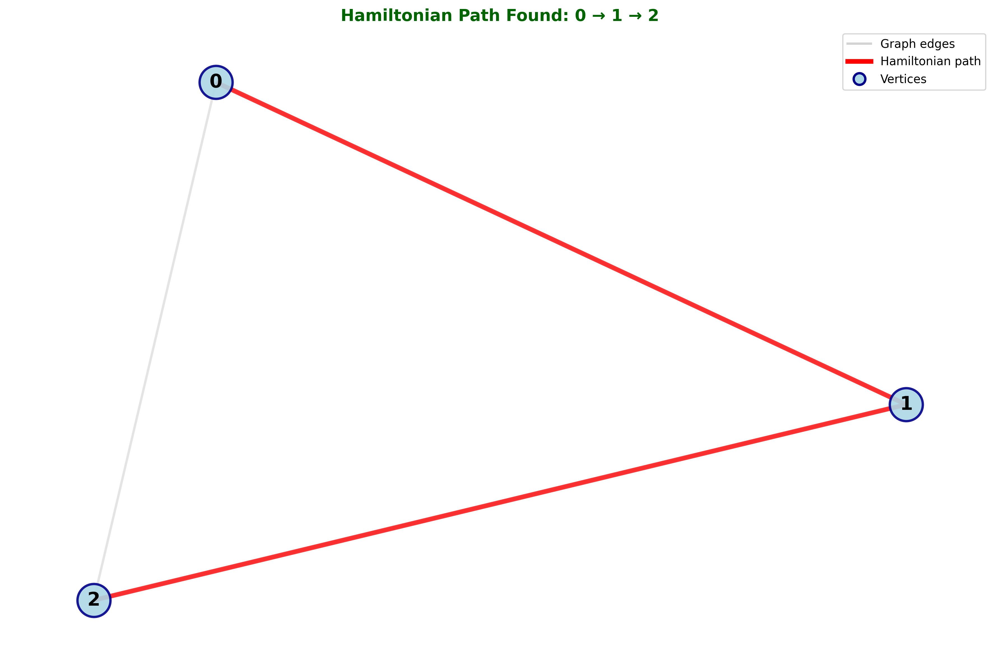
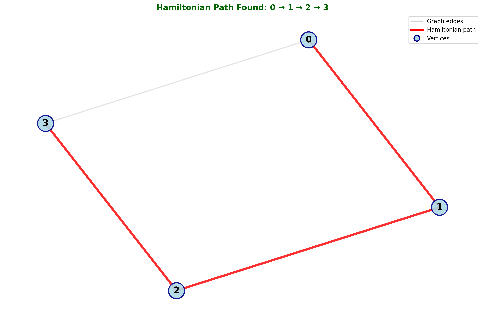
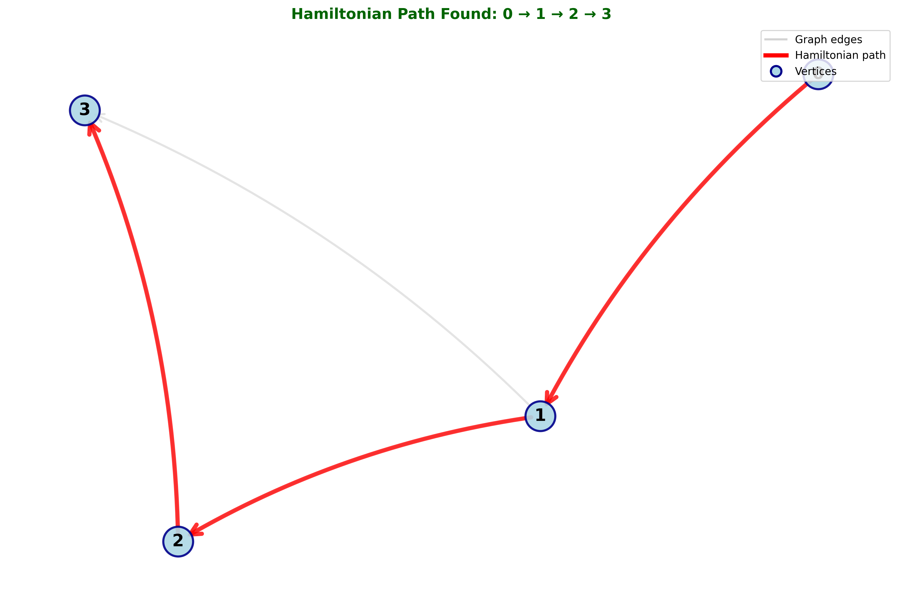
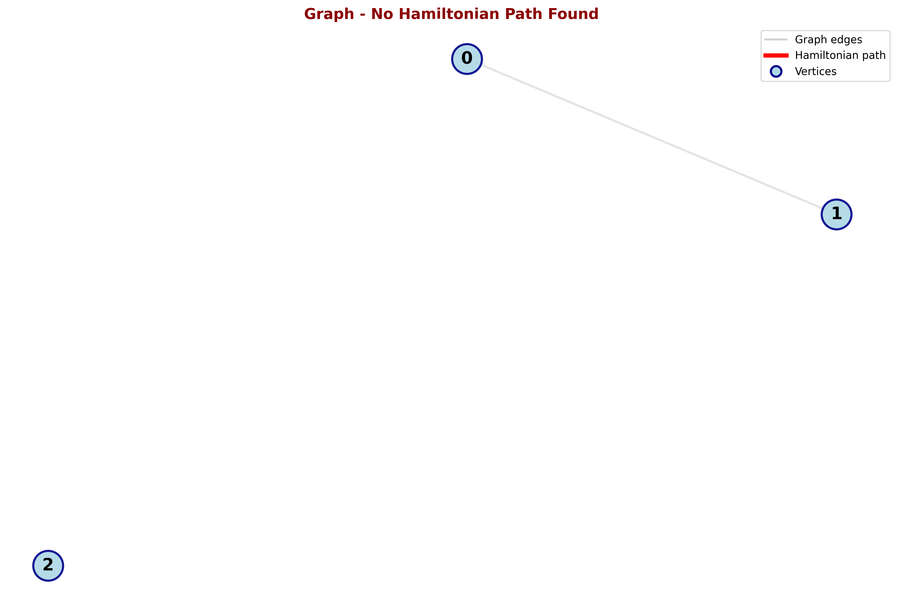
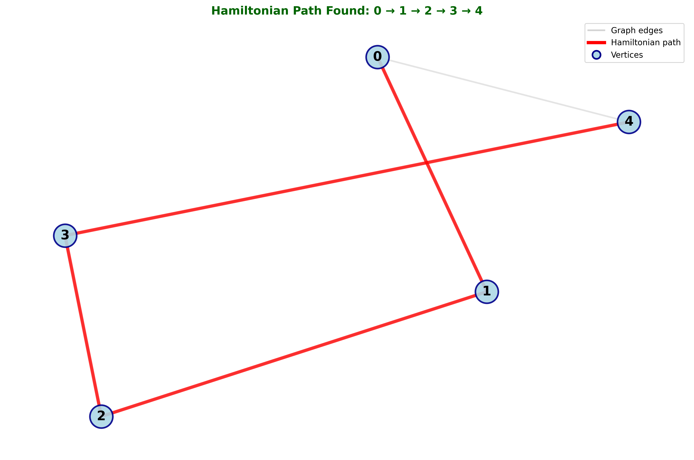

# Projeto - Algoritmo de Caminho Hamiltoniano

## Descrição do Projeto

O **Algoritmo de Caminho Hamiltoniano** é uma implementação que determina se existe um caminho em um grafo que visita cada vértice exatamente uma vez. Este projeto implementa o algoritmo em Python utilizando a técnica de **backtracking**, uma estratégia de busca exaustiva que explora todas as possibilidades até encontrar uma solução válida ou determinar que não existe caminho hamiltoniano.

Um Caminho Hamiltoniano é fundamental em teoria dos grafos e tem aplicações práticas em problemas como roteamento, planejamento de rotas, análise de redes e está intimamente relacionado ao famoso Problema do Caixeiro Viajante.

### Lógica do Algoritmo Implementado

O algoritmo utiliza a estratégia de **backtracking** (retrocesso) seguindo a seguinte lógica linha a linha:

```python
def find_hamiltonian_path(graph, directed=False):
    # Linha 1-3: Inicialização das estruturas de dados
    n = len(graph)              # Número de vértices no grafo
    path = []                   # Lista que armazenará o caminho encontrado
    visited = [False] * n       # Array de controle de vértices visitados
    
    # Linha 4-5: Definição da função recursiva de backtracking
    def backtrack(vertex, depth):
        # Linha 6-7: Marca o vértice atual como visitado
        path.append(vertex)     # Adiciona o vértice ao caminho
        visited[vertex] = True  # Marca como visitado
        
        # Linha 8-9: Verifica se todos os vértices foram visitados (solução encontrada)
        if depth == n:
            return True         # Caminho hamiltoniano completo encontrado
        
        # Linha 10-18: Explora todos os vizinhos possíveis
        for neighbor in range(n):
            # Linha 11-14: Verifica se existe aresta e se o vizinho pode ser visitado
            if directed:
                can_visit = graph[vertex][neighbor] == 1
            else:
                can_visit = (graph[vertex][neighbor] == 1 or graph[neighbor][vertex] == 1)
            
            # Linha 15-17: Tenta adicionar o vizinho ao caminho (recursão)
            if can_visit and not visited[neighbor]:
                if backtrack(neighbor, depth + 1):
                    return True  # Solução encontrada neste ramo
        
        # Linha 19-21: Backtracking - desfaz a escolha se não levou à solução
        path.pop()              # Remove o vértice do caminho
        visited[vertex] = False # Desmarca como visitado
        return False            # Indica que este ramo não levou à solução
    
    # Linha 22-25: Tenta iniciar o caminho de cada vértice possível
    for start in range(n):
        # depth=1 indica que já visitamos 1 vértice (o vértice inicial 'start')
        if backtrack(start, 1):
            return path         # Retorna o caminho encontrado
    
    # Linha 26: Nenhum caminho hamiltoniano existe
    return None
```

**Explicação da Estratégia:**
1. **Inicialização**: Prepara as estruturas de dados (caminho, vértices visitados)
2. **Escolha**: Seleciona um vértice não visitado conectado ao vértice atual
3. **Restrição**: Verifica se o vértice já foi visitado e se existe aresta
4. **Objetivo**: Checa se todos os vértices foram visitados (profundidade = n)
5. **Backtracking**: Se um caminho não leva à solução, desfaz as escolhas e tenta alternativas
6. **Tentativas múltiplas**: Tenta iniciar o caminho de cada vértice do grafo

**Nota importante sobre depth**: O parâmetro `depth` representa quantos vértices já foram visitados no caminho atual. Iniciamos com `depth=1` porque ao chamar `backtrack(start, 1)`, o vértice inicial já conta como o primeiro vértice visitado.

### Representação do Grafo

O grafo é representado como uma **matriz de adjacência** onde:
- `graph[i][j] = 1` indica que existe uma aresta do vértice i para o vértice j
- `graph[i][j] = 0` indica que não existe aresta
- Para grafos não orientados, a matriz é simétrica
- Para grafos orientados, a matriz pode ser assimétrica

## Como Executar o Projeto

### Pré-requisitos
- Python 3.6 ou superior
- Nenhuma biblioteca externa necessária para a funcionalidade básica
- Para visualização dos grafos (opcional):
  - NetworkX: `pip install networkx`
  - Matplotlib: `pip install matplotlib`

### Passos para Execução

1. **Clone o repositório:**
```bash
git clone https://github.com/arthurcuri/hamiltonian-path.git
cd hamiltonian-path
```

2. **Execute o programa de testes:**
```bash
python test_hamiltonian.py
```

3. **Saída esperada:**
```
Path found: [0, 1, 2]
Path found: [0, 1, 2, 3]
Path found: [0, 1, 2, 3]
Path found: None
Path found: [0, 1, 2, 3, 4]
```

### Exemplos de Uso

#### Exemplo 1: Grafo não orientado (triângulo)
```python
from hamiltonian_path import find_hamiltonian_path

graph = [
    [0, 1, 1],
    [1, 0, 1],
    [1, 1, 0]
]
result = find_hamiltonian_path(graph, directed=False)
print(f"Caminho Hamiltoniano: {result}")  # [0, 1, 2]
```

#### Exemplo 2: Grafo orientado
```python
graph = [
    [0, 1, 0, 0],
    [0, 0, 1, 1],
    [0, 0, 0, 1],
    [0, 0, 0, 0]
]
result = find_hamiltonian_path(graph, directed=True)
print(f"Caminho Hamiltoniano: {result}")  # [0, 1, 2, 3]
```

## Visualização de Grafos (Ponto Extra)

Este projeto inclui um módulo de **visualização gráfica** que permite desenhar grafos e destacar caminhos hamiltonianos usando NetworkX e Matplotlib.

### Instalação das Bibliotecas

Para utilizar a visualização, instale as bibliotecas necessárias:

```bash
pip install networkx matplotlib
```

Ou instale todas as dependências usando o arquivo requirements.txt:

```bash
pip install -r requirements.txt
```

### Como Usar a Visualização

#### Executar todos os exemplos:

```bash
python view.py
```

Este comando gerará automaticamente 5 imagens na pasta `assets/` demonstrando diferentes tipos de grafos:
1. **example1_triangle.png** - Triângulo (grafo não orientado)
2. **example2_square.png** - Quadrado (grafo não orientado)
3. **example3_directed.png** - Grafo orientado
4. **example4_no_path.png** - Grafo sem caminho hamiltoniano
5. **example5_pentagon.png** - Pentágono (grafo não orientado)

#### Visualizar um grafo personalizado:

```python
from view import visualize_hamiltonian_path

# Seu grafo (matriz de adjacência)
graph = [
    [0, 1, 1],
    [1, 0, 1],
    [1, 1, 0]
]

# Visualizar e salvar
visualize_hamiltonian_path(graph, directed=False, output_file='assets/meu_grafo.png')
```

### Características da Visualização

✅ **Grafo Original**: Todos os nós e arestas são desenhados com etiquetas de identificação

✅ **Destaque do Caminho**: As arestas do caminho hamiltoniano são destacadas em **vermelho** com espessura maior

✅ **Legenda**: Inclui legenda explicativa para diferenciar arestas normais e do caminho

✅ **Suporte a Grafos Orientados**: Desenha setas para grafos direcionados

✅ **Exportação PNG**: Imagens em alta resolução (300 DPI) salvas na pasta `assets/`

### Exemplos de Visualização

#### Exemplo 1: Triângulo com Caminho Hamiltoniano



**Caminho encontrado:** 0 → 1 → 2

#### Exemplo 2: Quadrado com Caminho Hamiltoniano



**Caminho encontrado:** 0 → 1 → 2 → 3

#### Exemplo 3: Grafo Orientado



**Caminho encontrado:** 0 → 1 → 2 → 3

#### Exemplo 4: Grafo sem Caminho Hamiltoniano



**Resultado:** Nenhum caminho hamiltoniano encontrado (grafo desconectado)

#### Exemplo 5: Pentágono



**Caminho encontrado:** 0 → 1 → 2 → 3 → 4

## Relatório Técnico

### 1. Classes de Complexidade: P, NP, NP-Completo e NP-Difícil

#### Classificação do Problema do Caminho Hamiltoniano

O **Problema do Caminho Hamiltoniano** pertence à classe **NP-Completo** quando formulado como problema de decisão ("Existe um caminho hamiltoniano neste grafo?").

**Justificativa:**

**1. Pertence a NP:**
- Dada uma solução candidata (uma sequência de vértices), podemos verificar em tempo polinomial O(n) se:
  - Todos os n vértices aparecem exatamente uma vez
  - Existe uma aresta entre cada par consecutivo de vértices no caminho
- Esta verificação é rápida e determinística

**2. É NP-Completo:**
- O problema é conhecido por ser NP-Completo através de redução do **Problema SAT** (satisfatibilidade booleana)
- Pode ser reduzido de outros problemas NP-Completos conhecidos, como o **Problema do Ciclo Hamiltoniano**
- Não existe algoritmo conhecido de tempo polinomial para resolver este problema

**3. Relação com o Problema do Caixeiro Viajante (TSP):**

| Aspecto | Caminho Hamiltoniano | Caixeiro Viajante |
|---------|---------------------|-------------------|
| **Classificação** | NP-Completo | NP-Difícil |
| **Tipo** | Problema de decisão | Problema de otimização |
| **Questão** | Existe caminho? | Qual o caminho de custo mínimo? |
| **Ciclo** | Não requer retorno | Deve retornar ao início |
| **Redução** | Pode ser reduzido a TSP | Inclui Hamiltoniano como subproblema |

**Características das Classes:**

- **Classe P**: Problemas que podem ser resolvidos em tempo polinomial (ex: busca em grafos, ordenação)
- **Classe NP**: Problemas cuja solução pode ser verificada em tempo polinomial
- **NP-Completo**: Problemas mais difíceis de NP; se um for resolvido em P, todos serão (P = NP)
- **NP-Difícil**: Pelo menos tão difíceis quanto os problemas NP-Completos, mas não precisam estar em NP

### 2. Análise da Complexidade Assintótica de Tempo

#### Determinação da Complexidade Temporal

**Método Utilizado: Contagem de Operações e Análise da Árvore de Recursão**

**Análise Detalhada:**

1. **Profundidade da Recursão:**
   - O algoritmo explora caminhos de comprimento até n (número de vértices)
   - Profundidade máxima da recursão: O(n)

2. **Ramificação em Cada Nível:**
   - Em cada chamada recursiva, o algoritmo pode explorar até (n-1) vizinhos
   - No pior caso, cada vértice pode estar conectado a todos os outros

3. **Número Total de Chamadas Recursivas:**
   - No pior caso, exploramos todas as permutações possíveis de vértices
   - Isso resulta em até n! (fatorial) chamadas recursivas

4. **Trabalho por Chamada:**
   - Verificar vizinhos: O(n)
   - Operações de marcação/desmarcação: O(1)
   - Total por chamada: O(n)

**Fórmula da Complexidade:**

```
T(n) = número de chamadas × trabalho por chamada
T(n) = O(n!) × O(n)
T(n) = O(n × n!)
```

**Complexidade Temporal Final: O(n × n!)**

**Análise Prática:**

| n (vértices) | n! | n × n! | Operações Aproximadas |
|-------------|----|---------|-----------------------|
| 5 | 120 | 600 | ~600 |
| 10 | 3,628,800 | 36,288,000 | ~36 milhões |
| 15 | 1.3 × 10¹² | 1.95 × 10¹³ | ~19 trilhões |
| 20 | 2.4 × 10¹⁸ | 4.8 × 10¹⁹ | Impraticável |

### 3. Aplicação do Teorema Mestre

#### Análise de Aplicabilidade

**O Teorema Mestre NÃO pode ser aplicado diretamente a este algoritmo.**

**Justificativa:**

O Teorema Mestre é aplicável a recorrências da forma:
```
T(n) = a·T(n/b) + f(n)
```

Onde:
- **a ≥ 1**: número de subproblemas
- **b > 1**: fator de redução do tamanho do problema
- **f(n)**: custo fora da recursão

**Critérios de Aplicabilidade do Teorema Mestre:**

1. **Divisão Regular**: O problema deve ser dividido em subproblemas de tamanho proporcional (n/b)
2. **Número Constante de Subproblemas**: O valor 'a' deve ser constante
3. **Recorrência Bem Definida**: A relação de recorrência deve seguir o padrão específico

**Por que NÃO se aplica ao Caminho Hamiltoniano:**

1. **Não há divisão do problema**: O algoritmo não divide o grafo em partes menores
2. **Número variável de subproblemas**: Cada vértice pode ter um número diferente de vizinhos
3. **Estrutura de permutação**: Explora permutações, não divisões sucessivas
4. **Backtracking puro**: A complexidade vem da exploração exaustiva, não de divisão e conquista

**Exemplos onde o Teorema Mestre se aplica:**
- Merge Sort: T(n) = 2T(n/2) + O(n)
- Binary Search: T(n) = T(n/2) + O(1)
- Multiplicação de Karatsuba: T(n) = 3T(n/2) + O(n)

**Conclusão:** O algoritmo de Caminho Hamiltoniano utiliza backtracking, não divisão e conquista, portanto o Teorema Mestre não é a ferramenta apropriada para sua análise.

### 4. Análise dos Casos de Complexidade

#### Melhor Caso: O(n²)

**Quando ocorre:**
- O primeiro vértice tentado já inicia um caminho hamiltoniano válido
- O caminho é encontrado na primeira exploração sem backtracking significativo
- Exemplo: grafo completamente conectado onde qualquer ordem funciona

**Análise:**
- Exploração linear de n vértices: O(n)
- Verificação de vizinhos em cada passo: O(n)
- Total: O(n × n) = O(n²)

**Exemplo de melhor caso:**
```
Grafo completo (todos conectados):
[0] → [1] → [2] → [3] → ... → [n-1]
```

#### Caso Médio: Dependente da Estrutura do Grafo

**Quando ocorre:**
- Grafos com densidade média de arestas
- Algumas tentativas de backtracking necessárias
- Comportamento típico em grafos aleatórios

**Análise:**
- A complexidade do caso médio varia significativamente dependendo da estrutura do grafo
- Para grafos densos (muitas conexões): aproxima-se do melhor caso, O(n²) a O(n³)
- Para grafos esparsos (poucas conexões): aproxima-se do pior caso, podendo chegar a O(n × n!)
- Em grafos aleatórios com densidade moderada: geralmente entre O(n³) e O(2ⁿ)

**Características:**
- **Altamente dependente da estrutura específica do grafo**
- Densidade de arestas afeta drasticamente o desempenho
- Grafos mais conectados tendem a ter melhor desempenho médio
- Heurísticas de ordenação podem melhorar significativamente o caso médio

**Fatores determinantes:**
- **Densidade de arestas**: mais arestas = mais opções = geralmente mais rápido
- **Distribuição de graus**: grafos com graus uniformes tendem a ter comportamento mais previsível
- **Existência de gargalos**: vértices com poucos vizinhos podem causar backtracking extensivo

#### Pior Caso: O(n × n!)

**Quando ocorre:**
- Não existe caminho hamiltoniano no grafo
- O algoritmo explora todas as possibilidades antes de concluir
- Grafos esparsos com conectividade limitada

**Análise:**
- Todas as permutações possíveis são exploradas
- Backtracking completo em todas as tentativas
- Cada vértice inicial é tentado: n × (n-1)! explorações

**Exemplo de pior caso:**
```
Grafo desconectado ou quase desconectado:
[0] - [1]    [2] - [3]    [4] (isolado)
Nenhum caminho hamiltoniano possível
```

#### Impacto no Desempenho

**Comparação Visual:**

| Tamanho (n) | Melhor Caso (n²) | Pior Caso (n × n!) | Diferença |
|-------------|------------------|---------------------|-----------|
| 5 | 25 | 600 | 24× |
| 10 | 100 | 36,288,000 | 362,880× |
| 15 | 225 | 1.95 × 10¹³ | 8.7 × 10¹⁰× |
| 20 | 400 | 4.8 × 10¹⁹ | 1.2 × 10¹⁷× |

**Fatores que Influenciam o Desempenho:**

1. **Densidade do Grafo:**
   - Grafos densos (muitas arestas): melhor desempenho
   - Grafos esparsos (poucas arestas): pior desempenho

2. **Estrutura do Grafo:**
   - Grafos com estrutura regular: desempenho mais previsível
   - Grafos aleatórios: alta variabilidade

3. **Existência de Solução:**
   - Solução existe e é facilmente encontrada: rápido
   - Não existe solução: explora todo espaço de busca

4. **Ordem de Tentativa dos Vértices:**
   - Começar pelo vértice "certo": pode reduzir drasticamente o tempo
   - Heurísticas podem melhorar o desempenho médio

**Estratégias de Otimização:**

1. **Poda Inteligente**: Eliminar ramos impossíveis antecipadamente
2. **Heurísticas**: Priorizar vértices com menos conexões (heurística gulosa)
3. **Algoritmos Aproximados**: Para grafos grandes, buscar soluções "boas o suficiente"
4. **Programação Dinâmica**: Algoritmo de Held-Karp para O(n² × 2ⁿ)

### Complexidade Espacial

**Análise do Espaço:**
- **Pilha de recursão:** O(n) profundidade máxima
- **Array de visitados:** O(n) espaço
- **Lista de caminho:** O(n) espaço
- **Matriz de adjacência:** O(n²) espaço (entrada)

**Complexidade Espacial Total: O(n²)**

A matriz de adjacência domina o uso de espaço, mas se considerarmos apenas as estruturas auxiliares do algoritmo (sem contar a entrada), a complexidade espacial seria O(n).

## Autor

- **Nome**: Arthur Kramberger
- **Repositório**: https://github.com/arthurcuri/hamiltonian-path
- **Disciplina**: Fundamentos de Projeto e Análise de Algoritmos
- **Data**: Outubro de 2025